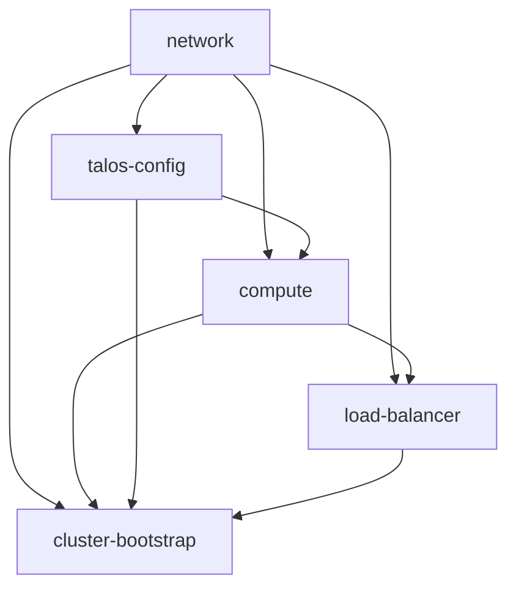

# AI Documentation — Deployment Flow & DAG Graph

This document explains the resource dependency graph, execution order, and bootstrap flow for deploying the Dockair sandbox infrastructure.

---

## 🗺️ Directed Acyclic Graph (DAG)

Deploying a cluster requires a strict sequential flow due to resource dependency mapping (e.g. VMs require Talos configs and networks to exist first).



### Dependency Summary
1. **`network`**: The root dependency. Allocates subnets, VPCs, and the Floating IP VIP.
2. **`talos-config`**: Reads the `network` floating IP to bake it into Talos certificate SANs.
3. **`compute`**: Reads the `network` private ID (to attach VMs) and the `talos-config` control plane/worker user data (to write node boot configurations).
4. **`load-balancer`**: Reads the control plane private IPs generated by `compute` to register them as backend pool members.
5. **`cluster-bootstrap`**: Triggered last. Requires node IPs from `compute`, VIP address from `network`, and client credentials from `talos-config` to send the `bootstrap` signal to the first control plane node.

---

## 🚀 Execution Guide

Terragrunt handles this DAG automatically using `dependency` declarations inside `live/_env/*.hcl` templates.

### Automated All-in-One Plan
To plan the entire tree (staging or prod) in dependency order:
```bash
terragrunt run --all plan --non-interactive
```

### Automated All-in-One Apply
To deploy the entire environment:
```bash
terragrunt run --all apply --non-interactive --terragrunt-include-external-dependencies
```

### Targeted Execution
If you need to deploy a specific module (e.g. just `network`), Terragrunt will trace and prompt to deploy prerequisites first:
```bash
cd live/staging/network
terragrunt apply
```
