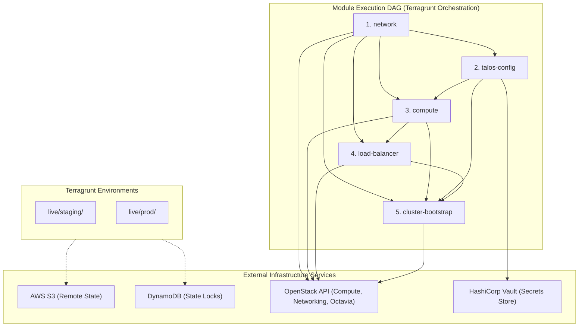

# Global Dependency Graph & Module Deployment Flow

This document details the global dependency structure, the integration of external platforms, and the execution order required to provision the Dockair Sandbox infrastructure.

## 🗺️ High-Level Infrastructure Topology

The provisioning process is fully automated and orchestrated via Terragrunt. It coordinates state storage, locks, cloud provider APIs, and security vaults across staging and production environments.



---

## ⚙️ Module Execution Dependency Analysis

To build the cluster successfully, modules must be applied in a strict order. Below is a breakdown of why this execution sequence is enforced:

### 1. `network` (Root Dependency)
- **What it does**: Provisions the OpenStack private network (VPC), subnet, routing gateways, and allocates a public-facing Floating IP (FIP).
- **Why it must run first**:
  - The internal subnet CIDRs are required by subsequent VM configurations.
  - The Floating IP is needed by `talos-config` to configure secure endpoint certificates, and by `load-balancer` to bind the external Virtual IP (VIP).

### 2. `talos-config`
- **What it does**: Generates PKI cryptographic material (Machine Secrets, Client Config) for the cluster, patches machine parameters, and stores secrets in HashiCorp Vault.
- **Dependencies**: Depends on `network` to receive the allocated Floating IP.
- **Why it must run before compute**:
  - It generates the custom machine configuration templates (`controlplane` and `worker` configurations) which are injected as `user_data` into the OpenStack VMs.
  - The Floating IP address must be baked into the Talos TLS certificate Subject Alternative Names (SANs) so that administrative clients can securely connect through the public Load Balancer later.

### 3. `compute`
- **What it does**: Deploys the actual Virtual Machines (1 Control Plane and 3 Workers) on OpenStack.
- **Dependencies**: Depends on `network` and `talos-config`.
- **Why it must run before load-balancer & bootstrap**:
  - It binds the VMs to the private Neutron network ports.
  - It injects the Talos OS machine configs (user-data) on boot to initialize the operating system.
  - It outputs the private IP addresses of the control plane nodes, which the load balancer needs to route traffic.

### 4. `load-balancer`
- **What it does**: Deploys an OpenStack Octavia Load Balancer, configures listeners on ports `6443` (Kubernetes API) and `50000` (Talos API), maps them to the control plane backends, and associates the Floating IP.
- **Dependencies**: Depends on `network` and `compute`.
- **Why it must run before bootstrap**:
  - Exposes the cluster's endpoints to the external network.
  - Allows the `cluster-bootstrap` process to reach the control plane APIs externally.

### 5. `cluster-bootstrap`
- **What it does**: Sends the one-time Talos bootstrap API command to the first control plane node to initialize the etcd database and form the cluster.
- **Dependencies**: Depends on `network`, `talos-config`, `compute`, and `load-balancer`.
- **Why it runs last**:
  - It requires the target control plane VM to be fully booted and listening on Port 50000.
  - It requires the Load Balancer to be active and routing requests to the control plane backend.
  - It requires the Talos client configuration generated in the `talos-config` step to authenticate the API request.

---

## 🚀 Orchestration Commands

Terragrunt automates this DAG using local dependency blocks inside `live/_env/*.hcl`. 

- **To plan the entire tree**:
  ```bash
  terragrunt run --all plan --non-interactive
  ```
- **To deploy the entire tree**:
  ```bash
  terragrunt run --all apply --non-interactive --terragrunt-include-external-dependencies
  ```
