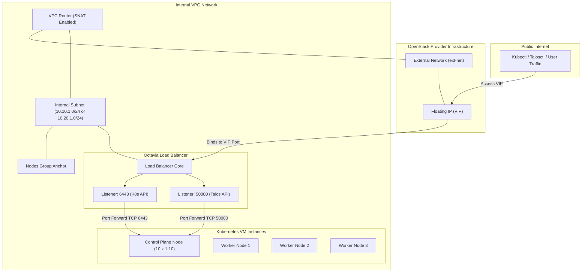
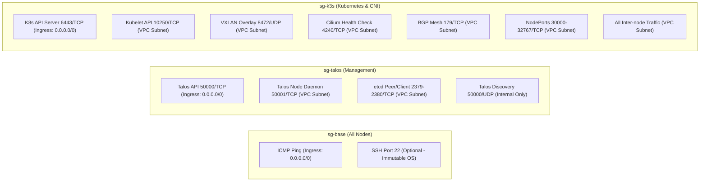

# Networking & Security Architecture

This document describes the OpenStack network topology, IP address management (IPAM) allocations, routing behaviors, and security group configurations.

## 🌐 Network Topology Diagram

The infrastructure runs inside a dedicated OpenStack VPC with isolated private subnets, fronted by an Octavia Load Balancer exposing public APIs via a Floating IP (FIP).

---

## 🗺️ IP Address Management (IPAM) Matrix

To ensure clean routing between environments and prevent address space conflicts, the repository enforces a strict IPAM layout.

| Environment | Component / CIDR Block | CIDR Range | Description |
| :--- | :--- | :--- | :--- |
| **Production** | Internal VPC Net | `10.10.0.0/16` | Global Production network boundary |
| **Production** | VM Instances Subnet | `10.10.1.0/24` | OpenStack VM private network (DHCP enabled) |
| **Production** | Kubernetes Pods (Cilium) | `10.10.8.0/21` | Internal Pod overlays (non-kube-proxy mode) |
| **Production** | Kubernetes Services | `10.10.16.0/21` | Virtual ClusterIPs |
| | | | |
| **Staging** | Internal VPC Net | `10.20.0.0/16` | Global Staging network boundary |
| **Staging** | VM Instances Subnet | `10.20.1.0/24` | OpenStack VM private network (DHCP enabled) |
| **Staging** | Kubernetes Pods (Cilium) | `10.20.8.0/21` | Internal Pod overlays (non-kube-proxy mode) |
| **Staging** | Kubernetes Services | `10.20.16.0/21` | Virtual ClusterIPs |

---

## 🔒 Security Group Rules

Three custom security groups (`sg-base`, `sg-talos`, `sg-k3s`) are applied to the Neutron ports of the VMs to enforce least-privilege traffic flow.

### Port Matrix Configuration Details

| Security Group | Port / Protocol | Remote Source | Description / Purpose |
| :--- | :--- | :--- | :--- |
| **`sg-base`** | `ICMP` | `0.0.0.0/0` | Used for remote connectivity troubleshooting and ping tests. |
| **`sg-base`** | `22 / TCP` | `VPC Subnet` | Standard SSH port (if applicable). Talos OS is an immutable, API-driven operating system; it does not deploy a shell/SSH server, but the group keeps baseline structure. |
| **`sg-talos`** | `50000 / TCP` | `0.0.0.0/0` (via LB) | Talos Management API used by `talosctl` to query health, apply configs, and reboot nodes. |
| **`sg-talos`** | `50001 / TCP` | VPC Subnet (`10.x.1.0/24`) | Talos Node Daemon API for secure internal cluster communication. |
| **`sg-talos`** | `2379-2380 / TCP` | VPC Subnet (`10.x.1.0/24`) | etcd database client and peer communication for control plane state replication. |
| **`sg-talos`** | `50000 / UDP` | VPC Subnet (`10.x.1.0/24`) | Talos discovery services (standard port configuration). |
| **`sg-k3s`** | `6443 / TCP` | `0.0.0.0/0` (via LB) | Kubernetes API Server endpoint used by `kubectl` to manage workload definitions. |
| **`sg-k3s`** | `10250 / TCP` | VPC Subnet (`10.x.1.0/24`) | Kubelet API. Enables API server to node agent communications (logs, exec, metrics). |
| **`sg-k3s`** | `8472 / UDP` | VPC Subnet (`10.x.1.0/24`) | VXLAN overlay routing. Required for Cilium CNI pod-to-pod network tunnel encapsulation (can support Geneve on UDP `6081` if configured). |
| **`sg-k3s`** | `4240 / TCP` | VPC Subnet (`10.x.1.0/24`) | Cilium Agent health checking. Used to monitor CNI connectivity and mesh health status. |
| **`sg-k3s`** | `179 / TCP` | VPC Subnet (`10.x.1.0/24`) | BGP routing protocol. Allows advertisement of Pod networks/external routes where applicable. |
| **`sg-k3s`** | `30000-32767 / TCP` | VPC Subnet (`10.x.1.0/24`) | Kubernetes NodePort service range (standard allocation). |
| **`sg-k3s`** | `ANY` | VPC Subnet (`10.x.1.0/24`) | Full internal subnet communication. Allows any protocol to communicate unimpeded between internal nodes. |

---

## 🔄 Incoming Traffic Routing Path

The details below explain the route that external administrative client requests (e.g. `kubectl` or `talosctl`) take to interact with the cluster:

1. **User Request**: The operator launches `kubectl get pods` targeting the Load Balancer IP.
2. **Floating IP**: The packet is routed over the public internet to the OpenStack Provider Network gateway, reaching the assigned public Floating IP (`ext-net` pool).
3. **Octavia Load Balancer VIP**: The Floating IP is bound to the Virtual IP (VIP) port of the Octavia Load Balancer. The load balancer receives the packet on listener Port `6443` (Kubernetes) or `50000` (Talos).
4. **Backend Pool Routing**: The load balancer evaluates the active members of the pool (the control plane private IPs, e.g., `10.x.1.10`) using a `ROUND_ROBIN` load-balancing method.
5. **Security Group Filtering**: As the packet enters the target control plane VM's Neutron port, it is filtered by `sg-k3s` (which accepts Port `6443` from `0.0.0.0/0`) or `sg-talos` (which accepts Port `50000` from `0.0.0.0/0`).
6. **Processing**: The internal service processes the request and responds back through the SNAT-enabled VPC router to the user.
