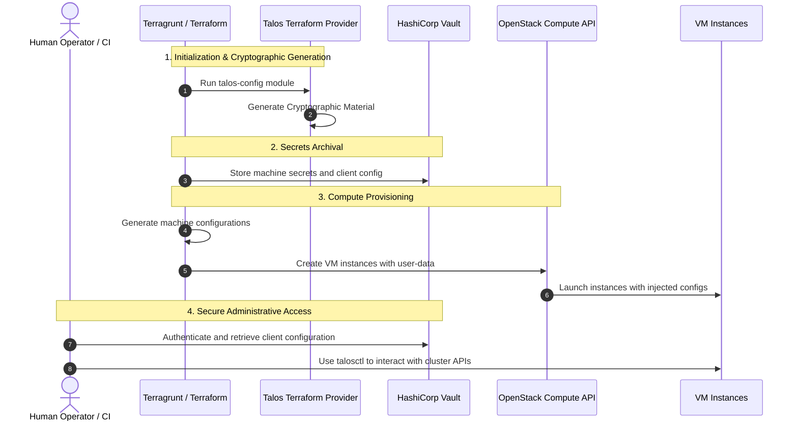

# Secrets Management & PKI Lifecycle

This document describes the cryptographic Public Key Infrastructure (PKI) lifecycle for the Talos OS cluster, how secrets are securely stored in HashiCorp Vault, and how engineers/CI pipelines obtain access credentials.

## 🔑 Secrets Generation & Provisioning Flow

To guarantee absolute security and maintain a GitOps pipeline, no secret material is ever persisted to source control. The diagram below details the sequence of secrets generation, archival, compute injection, and administrative retrieval:



---

## 🛡️ Security Boundaries

1. **Zero Secrets in Git**: 
   - Cryptographic elements like the Talos machine secrets, Kubernetes bootstrap tokens, private keys, and certificate authorities are generated dynamically during the `talos-config` step.
   - None of these values are checked into version control. Standard Git hooks and CI scan scripts enforce this rule.
2. **HashiCorp Vault KVv2 Backend**:
   - The generated secrets are stored directly inside HashiCorp Vault under the path:
     `kvv2/<project_name>/<env>/talos/cluster-secrets`
   - Data stored includes:
     - `cluster_name`: Dynamic identifier (`dockair-sandbox-staging` or `dockair-sandbox-prod`).
     - `cluster_endpoint`: Public load balancer API address (`https://<lb_public_ip>:6443`).
     - `machine_secrets`: Secret configuration block containing root certificates and bootstrap tokens.
     - `client_config`: The generated administrative client config (`talosconfig`) for cluster control.
3. **State File Warning**:
   - Although secrets are stored in Vault, the underlying Terraform state files (saved in S3) contain outputs and variable data in plaintext. Standard mitigations (strict S3 bucket IAM policies, DynamoDB lock table restrictions, and encryption at rest) are configured as a safeguard.

---

## 🛠️ Retrieval & Access Instructions for Engineers

Once the infrastructure is successfully deployed, human engineers or CI/CD pipelines need the administrative configuration to manage the cluster.

### Step 1: Authenticate to HashiCorp Vault
Before querying the secrets engine, authenticate using your Vault credentials (OIDC, Token, Userpass, or AppRole depending on the environment setup):
```bash
# Set your Vault server address
export VAULT_ADDR="https://vault.yourdomain.com:8200"

# Authenticate (example using OIDC/Okta)
vault login -method=oidc
```

### Step 2: Retrieve the Talos Client Configuration
Read the secrets block using the `vault` CLI and extract the `client_config` (which corresponds to the `talosconfig` file):
```bash
# Query the Vault endpoint and parse the JSON response
vault kv get -field=client_config kvv2/dockair-sandbox/staging/talos/cluster-secrets > staging-talosconfig
```

### Step 3: Configure `talosctl`
Verify you can connect to the Talos control plane using the retrieved credentials:
```bash
# Query node and cluster health
talosctl --talosconfig staging-talosconfig --endpoints <lb_public_ip> --nodes <bootstrap_node_ip> health
```

### Step 4: Extract the Kubernetes `kubeconfig`
If the cluster has been successfully bootstrapped, you can use the Talos API client configuration to retrieve the Kubernetes administrator configuration:
```bash
# Retrieve the kubeconfig file via Talos API
talosctl --talosconfig staging-talosconfig --endpoints <lb_public_ip> --nodes <bootstrap_node_ip> kubeconfig ./kubeconfig

# Test connection to the Kubernetes API
kubectl --kubeconfig ./kubeconfig get nodes
```
